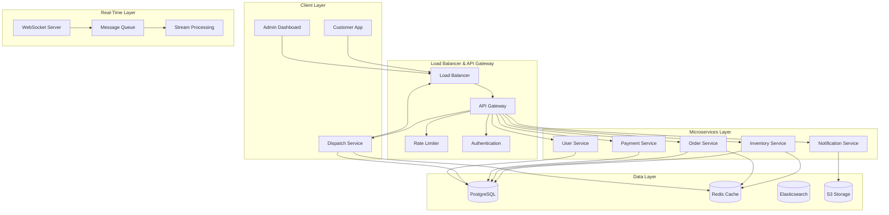
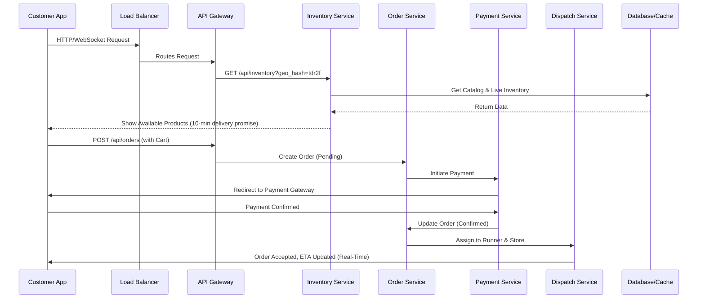
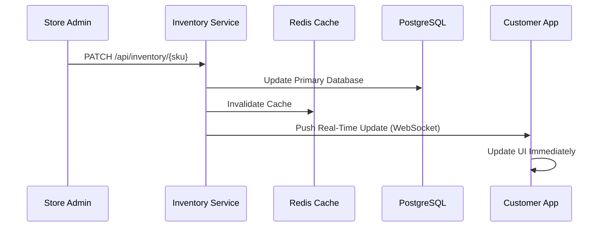

# 🏗️ ShopEasy Quick Commerce - System Architecture

## 🎯 **System Overview**
ShopEasy is a **10-minute delivery** e-commerce platform built with microservices architecture, real-time updates, and geo-partitioned inventory management.

## 🏛️ **High-Level Architecture**



## 🔄 **Technical Flow - Quick Commerce**

### **1. Customer Journey (10-Min Delivery)**



### **2. Real-Time Inventory Management**



## 🏪 **Dark Store Management System**

### **Real-Time Command Center Features:**

1. **Live Inventory Dashboard**
   - Real-time stock levels
   - Auto-reorder alerts
   - Expiry date tracking

2. **Order Fleet Management**
   - Live runner locations
   - Route optimization
   - ETA calculations

3. **Demand Forecasting**
   - Peak hour predictions
   - Seasonal trends
   - Stock optimization

4. **Dynamic Pricing**
   - Surge pricing during peak hours
   - Inventory-based pricing
   - Competitor price monitoring

## 🛠️ **Technology Stack**

### **Backend Services**
```yaml
Inventory Service:
  - Language: Node.js/Express
  - Database: PostgreSQL + Redis
  - Cache: Redis Cluster
  - Real-time: WebSocket + SSE

Order Service:
  - Language: Node.js/Express
  - Database: PostgreSQL
  - Queue: Apache Kafka
  - State Machine: Temporal

Payment Service:
  - Language: Node.js/Express
  - Gateways: Razorpay, Stripe, UPI
  - Database: PostgreSQL
  - Security: PCI DSS compliant

Dispatch Service:
  - Language: Node.js/Express
  - Real-time: WebSocket + MQTT
  - Maps: Google Maps API
  - Optimization: Genetic Algorithm
```

### **Data Layer**
```yaml
Primary Database:
  - PostgreSQL 15+ (Multi-region)
  - Connection Pooling: PgBouncer
  - Read Replicas: 3 instances

Cache Layer:
  - Redis Cluster (6 nodes)
  - Session Storage
  - Inventory Counts
  - Product Catalog

Search Engine:
  - Elasticsearch 8.x
  - Product Search
  - Auto-complete
  - Fuzzy Matching

Storage:
  - AWS S3 / Google Cloud Storage
  - CDN: Cloudflare
  - Image Optimization
```

### **Real-Time Infrastructure**
```yaml
WebSocket Server:
  - Socket.io / ws
  - Redis Adapter (scalable)
  - Room-based subscriptions
  - Heartbeat monitoring

Message Queue:
  - Apache Kafka
  - Event streaming
  - Order events
  - Inventory updates

Stream Processing:
  - Apache Flink
  - Real-time analytics
  - Demand forecasting
  - Anomaly detection
```

## 🚀 **Performance Optimizations**

### **Speed Optimizations (10-Min Delivery)**
1. **Geo-Partitioning**
   - User requests routed to nearest dark store
   - Local inventory cache
   - Reduced latency

2. **Heavy Caching**
   - Product catalog: Redis (100ms response)
   - Inventory counts: In-memory cache
   - Images: CDN (global edge locations)

3. **Microservices Benefits**
   - Independent scaling
   - Fault isolation
   - Technology diversity
   - Team autonomy

4. **Asynchronous Processing**
   - Non-critical tasks queued
   - Real-time order flow prioritized
   - Background analytics processing

## 🔒 **Security & Compliance**

### **Security Measures**
```yaml
Authentication:
  - JWT tokens
  - OAuth 2.0
  - Phone number verification
  - Biometric authentication

Authorization:
  - Role-based access control
  - API rate limiting
  - IP whitelisting
  - Audit logging

Data Protection:
  - End-to-end encryption
  - PCI DSS compliance
  - GDPR compliance
  - Data anonymization
```

## 📊 **Monitoring & Analytics**

### **Real-Time Monitoring**
```yaml
Application Metrics:
  - Response times
  - Error rates
  - Throughput
  - Resource usage

Business Metrics:
  - Order success rate
  - Delivery times
  - Customer satisfaction
  - Revenue per order

Infrastructure:
  - Server health
  - Database performance
  - Cache hit rates
  - Network latency
```

## 🚀 **Deployment Strategy**

### **Render Backend Deployment**
```yaml
Service: Web Service
Environment: Node.js
Build Command: npm install
Start Command: npm start
Plan: Starter ($7/month)
Auto-deploy: Enabled
Health Check: /health
```

### **Frontend Deployment**
```yaml
Customer App: Vercel
Admin Dashboard: Vercel
Dark Store App: Vercel
CDN: Cloudflare
```

## 🔄 **Development Workflow**

### **CI/CD Pipeline**
```yaml
GitHub Actions:
  - Code quality checks
  - Automated testing
  - Security scanning
  - Auto-deployment to Render

Testing Strategy:
  - Unit tests: Jest
  - Integration tests: Supertest
  - E2E tests: Playwright
  - Performance tests: Artillery
```

## 💰 **Cost Optimization**

### **Render Pricing**
- **Free Tier**: 750 hours/month
- **Starter**: $7/month (unlimited)
- **Standard**: $25/month (better performance)

### **Cost-Saving Tips**
1. Use free tier for development
2. Scale up only during peak hours
3. Optimize database queries
4. Implement efficient caching
5. Use CDN for static assets

## 🎯 **Next Steps**

1. **Deploy Backend to Render**
2. **Update Frontend API URLs**
3. **Implement Real-time Features**
4. **Add WebSocket Support**
5. **Set up Monitoring**
6. **Performance Testing**

---

*This architecture ensures ShopEasy can deliver on its 10-minute delivery promise while maintaining scalability, reliability, and cost-effectiveness.*
